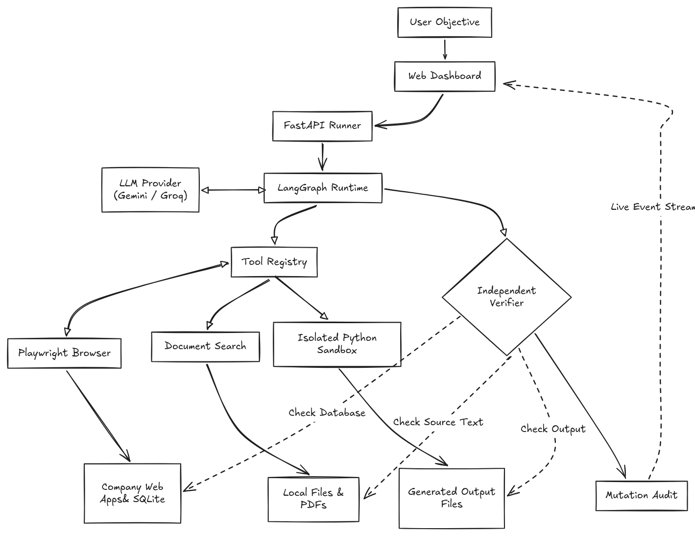

# TaskFlow; Autonomous AI Task Worker

TaskFlow takes a natural-language objective and carries it out across a local company workspace. It can read source documents, look up customer accounts, enter invoices, create support tickets and analyze CSV files locally. The model chooses actions; independent verification checks the result before the run can succeed.

*Note: This is first prototype*

## System flow:
<p align="center">
  
</p>

## How a task runs

1. **Start**: You enter an objective in the web dashboard. The server locks the local workspace for a single run and boots the LangGraph loop.
2. **Plan**: The model breaks the goal into concrete steps and picks one tool at a time based on current observations.
3. **Execute**:
   - **Browser**: Fills forms and clicks buttons in real web apps (Finance invoices, CRM accounts, Support tickets) using Playwright.
   - **Documents**: Searches and reads local invoice PDFs and customer complaint records.
   - **Python**: Executes analysis scripts in an isolated Linux sandbox to inspect and process CSV tables.
4. **Persist**: Browser actions write directly to the local SQLite database; data analyses save generated files to disk.
5. **Verify**: When an action claims completion, an independent read-only verifier checks the database and source files directly. The model is never trusted on its own word.
6. **Audit and stream**: A final audit ensures only expected database mutations occurred, and progress streams live to the dashboard over SSE.

## Workflow and capabilities

LangGraph coordinates typed subtasks, model decisions, tool execution, observations, memory and verification. The same runtime handles all three demo objectives; there are no scripted invoice, complaint or sales workflows.

| Capability | Operations | Boundary |
| --- | --- | --- |
| Browser | Open, inspect, click, type, select and go back | Actual app forms, current control IDs, allowed-origin restrictions |
| Documents | Inspect files, search and read chunks | Local extraction with bounded excerpts and source provenance |
| Python | Profile datasets and execute generated analysis | Sample/full local execution under namespace and syscall restrictions |

- Only the current browser page exposes actionable controls. Historical pages retain source-backed evidence and observed values, while documents and web pages remain untrusted task data.
- Business writes go through browser forms into SQLite. Unknown outcomes require inspection, and transient errors like a pre-commit 503 are surfaced directly so the model can choose whether to retry.
- A confirmed mutation and observed persisted delta trigger independent verification before another executor decision. Persistence itself is not proof of success.
- Submitting the same company and invoice number again updates the existing invoice in place. Its record ID and creation time stay intact, and the saved values still pass independent source checks.
- Verifiers independently check source identity, latest-invoice selection, money, currency, due dates, exact accounts, conditional ticket creation, grounded summaries, and unwanted mutations. Completed runs also pass a deterministic final mutation audit, while multi-task goals receive an additional coverage assessment.

See [the architecture](docs/architecture.md) for component ownership.

## Local CSV analysis

Raw CSV content stays local. The provider receives a bounded profile with shape, column types, statistics and three sample rows. Generated code reads registered paths through `inputs[document_id]`, writes only under `output_dir`, and returns compact metrics or named pandas DataFrames. Tables become local artifacts with bounded previews.

The worker validates code, runs a sample before full execution where applicable, and records input/code hashes and row counts. Supported imports are pandas, numpy, math, statistics, datetime and json. Trusted normalization accepts supported scalar types and flat metrics without rewriting generated code. A successful full execution owns the final result; the model's echo is retained only as a diagnostic. An independent calculation contract recomputes supported grouped comparisons against the full dataset.

Bubblewrap hides host/project directories and credentials and isolates network/process namespaces. Seccomp denies process creation, sockets and namespace changes. Missing isolation fails closed; there is no unsafe fallback. The worker has a 1 GiB address-space limit,8-second CPU limit and15-second wall deadline per stage. Output and artifact transfer are bounded. These are tested prototype safeguards, not a universal security guarantee.

## Run locally

Tested with Python 3.12 on Linux, Chrome, bubblewrap and libseccomp. On Debian/Ubuntu:

```bash
sudo apt install bubblewrap libseccomp2
python3 -m venv .venv
.venv/bin/pip install -r requirements.txt
cp .env.example .env
```

For the tested demo provider, set these in `.env`:

```bash
# -- default to gemini: --

LLM_PROVIDER=gemini
LLM_MODEL=gemini-3.5-flash-lite
GEMINI_BASE_URL=https://generativelanguage.googleapis.com/v1beta
GEMINI_API_KEY=your-key
GEMINI_MAX_RPM=12
GEMINI_MAX_RPD=480

# if you're using groq:
LLM_PROVIDER=groq
GROQ_MODEL=openai/gpt-oss-120b
GROQ_KEY=your-key
```

Then start the server:

```bash
.venv/bin/uvicorn backend.app.main:app --host 127.0.0.1 --port 8000
```

Open http://127.0.0.1:8000/dashboard. Use one server process and one active run. Reset Demo restores synthetic records while preserving run history; writes and resets from other clients are blocked during an owned run.

Chrome defaults to `/usr/bin/google-chrome`; change `TASKFLOW_CHROME_PATH` if needed. Set `TASKFLOW_WORKSPACE_URL` to the exact server origin when changing the address. Database, screenshots and artifacts default to `data/`; override them with `TASKFLOW_DB_PATH`, `TASKFLOW_SCREENSHOTS_DIR` and `TASKFLOW_ARTIFACTS_DIR`.

Gemini remains selectable with `LLM_PROVIDER=gemini`, `GEMINI_MODEL` and `GEMINI_API_KEY`. The example configuration defaults to Gemini, so explicitly select Groq for the certified demo setup. Provider-specific model settings take precedence over shared `LLM_MODEL`. There is no automatic provider/model fallback.

## Limits and model usage

Defaults are 20 decisions, 600 seconds per run, two verification attempts per task and one replan. Python allows up to three distinct program attempts per task within the shared six-call execution budget. Repeated failed programs and semantic browser cycles are bounded.

CSV inputs are limited to 20 MiB, 200,000 rows and 64 columns. PDF/text extraction is local; selected chunks carry document/page/section provenance. A small document may fit entirely in one excerpt. Full CSVs and large result tables are not uploaded.

Structured responses use JSON-schema generation, application-side validation and one bounded schema repair. Groq detects duplicate JSON keys and uses provider rate headers for bounded pacing/retries. Gemini reserves a persistent shared request budget; its default limits are 12 requests per rolling minute and 480 per rolling day. The ledger counts TaskFlow requests, not other clients using the credential.

Quota exhaustion stops honestly. Provider pacing can make a demo take several minutes. Final reports show actual requests and reported tokens; usage is marked partial when a failed response contains no token accounting.

## Tests and demo evidence

Run deterministic tests without model calls:

```bash
TASKFLOW_RUN_REAL=0 .venv/bin/pytest -q tests
```

Real acceptance is opt-in and consumes provider quota. Run a specific case only when you intend to make live requests:

```bash
TASKFLOW_RUN_REAL=1 LLM_PROVIDER=groq GROQ_MODEL=openai/gpt-oss-120b \
  .venv/bin/pytest -q -s tests/test_v2_real_acceptance.py::test_v2_invoice
```

The invoice, complaint and sales-analysis demos passed live with Groq and Gemini, including independent verification, safe 503 recovery and no unwanted mutations. The latest software regression suite passed 465 tests. See [validation results](docs/validations.md) for outcomes, usage and timing.

Demo objectives:

1. Find the latest invoice from Acme Corp, extract the amount and due date, enter it into Finance, and verify that it was recorded correctly.
2. Read complaint 4821, identify the customer, check their CRM account, and if they are an Enterprise customer, create a high-priority support ticket summarizing the complaint.
3. Analyze sales.csv and identify the region with the largest absolute revenue decline between 2026-08 and 2026-09, including the calculated decline.

Complaint 4822 covers the non-Enterprise no-op in deterministic and live tests. Fixture answers belong to tests, not runtime workflow rules.

## Live deployment

TaskFlow is also running as a small hosted demo on AWS EC2:

**Live demo:** https://ai-worker.duckdns.org/dashboard

The current deployment uses:

- Ubuntu 24.04 on EC2
- 2 vCPU / 4 GB RAM
- Docker for the application runtime
- Headless Chromium + Playwright for browser actions
- Bubblewrap + seccomp for isolated Python execution
- Caddy as the HTTPS reverse proxy
- DuckDNS for the public hostname

FastAPI runs inside the container on port `8000`, while Caddy exposes the app over HTTPS.

The Python sandbox also runs inside Docker, so the container needs the namespace/mount permissions required by Bubblewrap. API keys remain outside the image and are supplied through environment variables.

It's deployed as a public demo of the prototype rather than a production multi-user service..

## Scope

Currently it's just a synthetic local prototype for one trusted operator, without production authentication or deployment guarantees. Verification supports the current applications, labelled sources and grouped numeric comparisons; arbitrary domains, layouts and analyses are not universally supported. Ties, ambiguous identities and missing fields stay unresolved.

Company-name aliases and other feature improvs have been leftout, will work on them later. Thus use the vendor or customer name shown in the source records.

## Author

This was a great project to build and learn from. In the future, once it's running even more smoothly and supports broader desktop-level tools and actions, at this point I'd love to integrate my [whisper-dictate](https://github.com/kr-adarsh/whisper-dictate) project into this to turn it into a full Jarvis-like assistant..haha, maybe later.

*~Kr-Adarsh*
