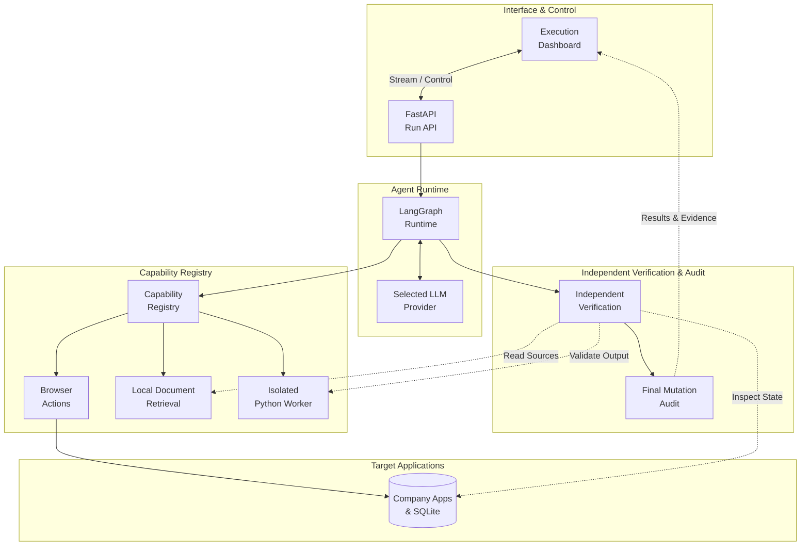

# TaskFlow architecture

TaskFlow is a local prototype that carries out a natural-language objective across Finance, CRM, Support and document applications. Browser actions write to SQLite; generated Python analyzes registered CSV files locally.

## Who owns what

- The planner creates typed subtasks. The executor selects one action from current observations; it has no invoice or complaint workflow script.
- The runtime enforces dependencies, budgets and tool schemas, retains evidence, and records each decision and outcome.
- Only the current browser page exposes actionable control IDs. Historical pages retain evidence and observed values.
- The provider adapter handles transport, structured responses, validation and bounded repair. Provider selection is explicit.
- Browser forms own business writes. A confirmed mutation plus an observed persisted delta triggers independent verification before another executor decision.
- Successful full Python execution owns its result. The model's final echo is diagnostic and cannot replace computed metrics.
- Verifiers independently read sources and persisted state or recompute calculations. Completion also requires a deterministic audit of all business mutations.

## Boundaries

Documents and webpages are untrusted task data. Raw CSVs remain local; the model receives a bounded profile, generated code and compact execution results. Python runs under namespace and syscall restrictions and fails closed when isolation is unavailable.

The workspace supports one active run. There is no production authentication, automatic interrupted-run resume or unrestricted verification of arbitrary domains. Read the README for setup and limits.
